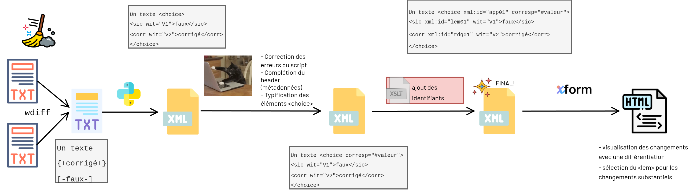

```{=latex}
\doublespacing
```

<!-- Il faut mettre un style csl avec notes de bas de page
 -->
Ce travail constitue une expérimentation-réflexion autour de la modélisation de la révision éditoriale, notamment dans le cadre de l'édition scientifique. Les sources sont les versions de travail de trois articles de la revue *Sens Public*, récupérées sur l'éditeur collaboratif en ligne Stylo, qui permet le versionning, et donc de remonter à des états antérieurs du texte. Il s'agit non seulement de modéliser les types de correction, mais aussi le processus dialogique qui s'engage entre les divers·es acteur·rices. Nous voudrions dépasser une approche strictement typologique des révisions pour les intégrer à la dynamique de leur réception et de leur discussion, en nous inspirant des gestes et des pratiques des éditeur·rices. 

Aujourd'hui Stylo montre un défaut : l’invisibilisation du travail éditorial. La fonctionnalité de comparaison des versions était insatisfaisante car elle manquait de lisibilité, et a été supprimée dans le but d'être améliorée. De manière générale, le dialogue entre éditeur·ice et auteur·ice tend à se déplacer vers des outils externes. Cela se traduit par une fragmentation des échanges-- multiplication de fichiers, de commentaires, de courriels -- qui affaiblit la cohérence du processus éditorial et souligne l'impensé du workflow. Dans Stylo, cette limite est partiellement contournée par l’intégration d’Hypothesis, qui cependant ne permet pas une modélisation des interventions sur le texte. C’est précisément là que réside la force du *Track Changes* de Word : il rend le travail des correcteur·rices immédiatement visible, traçable et négociable, et ce dans un seul fichier.

L’enjeu est donc de concevoir un dispositif qui permette à la fois de mieux structurer l’échange entre auteur·ice et correcteur·ice, de rendre visible le travail éditorial, et ce sans renoncer à une modélisation des différents types d’interventions. Ce travail constitue d'ailleurs une réflexion sur la pertinence des différents types d'intervention à visibiliser en priorité.

Les premiers entretiens informels menés avec les éditeur·rices de *Sens Public* et de *Humanités Numériques* montrent que la classification des révisions ne peut être pensée indépendamment des métiers et des expertises mobilisés. La première distinction qui paraîtrait aidante relève du degré d’"importance" des corrections. Ce terme, employé par Florence Daniel (éditrice de *Humanités Numériques*), revêt selon nous une connotation hiérarchisante. Nous n'emploierons pas ce terme afin d'éviter de distinguer les types de correction en termes de niveau mais plutôt en termes de domaine d'expertise mobilisé.

Les corrections orthotypographiques et grammaticales, les vérifications de fond et de forme sur la bibliographie, ou l'assurance d'un rendu final conforme relèvent du domaine des correcteur·rices et éditeur·rices. Elles ne sont pas moins importantes et participent également à la production du sens, d'ailleurs les auteur·rices doivent en prendre connaissance, mais ils doivent les recevoir comme des corrections de la part d'experts de la langue. Les reformulations plus substantielles -- déplacements de segments, suppressions de redondances, reformulations visant la clarté -- engagent davantage la structure du propos ou bien le style auctorial, et prennent alors la valeur de suggestions ou de questions adressées à l’auteur·ice. 

Prolongeant les pratiques de l’édition papier (dans lesquelles il était d'usage d'indiquer par des signes normalisés la nature précise des corrections) dans l'environnement numérique, nous aimerions aussi superposer une catégorisation plus fine. Pour élaborer cette typologie, nous nous sommes appuyée sur les distinctions formulées dans le Chicago Manual of Style (18ᵉ édition) [@ChicagoManualStyle], qui propose un état des lieux très complet des étapes du processus de publication et d’édition, et des différentes règles orthotypo à respecter. Prenant chacune des catégories du sommaire, nous avons tenté de les factoriser pour avoir un nombre plus limité de types.

Nous avons travaillé directement sur la syntaxe Markdown considérée comme du texte brut, car les éditeur·rices et auteur·rices de Sens Public produisent et corrigent directement les articles dans ce format. Une part significative du travail des éditeur·rices consiste précisément à intervenir sur le balisage Markdown, et non uniquement sur le contenu linguistique.

Voici donc la double catégorisation appliquée :

1. Corrections mécaniques : mécanique de la langue, mécanique du code, mécanique de la pipeline, fluidité de la lecture

- orthographe -- rectifications d’erreurs d'orthographe, harmonisation des graphies.
- Casse, capitalisation, abréviations, ponctuation, faces -- questions d'uniformisation des majuscules/minuscules, des abréviations, des signes de ponctuation, espaces insécables. Ces changements peuvent éventuellement se faire en masse.
- Numérotation, listes, dates, chiffres -- correction ou cohérence des éléments numériques.
- Grammaire et Syntaxe -- accord, conjugaison, structure de phrases, impropriétés syntaxiques.
- Code markdown -- harmonisation et correction pour rentrer sans frottement dans la chaîne de conversion. Dans cette catégorie peut rentrer la correction du BibTeX et de l'insertion de la citation dans le corps de texte. Ici, le rendu présentationnel côtoie le sémantisme des données. 

2. Modifications énonciatives ou discursives (assumant la position de l'auteur) : affectent l’organisation du discours, la rhétorique, le style, la voix de l’auteu·rice et impliquent un dialogue plus proche avec celleux-ci.

- ponctuation -- virgules, points, tirets, guillemets, usage des italiques avec une incidence sur l'argumentaire ou le style.
- Substitutions lexicales / de genre / de nombre avec une incidence sur l'argumentaire ou le style.
- Ajouts ou suppressions de mots/phrases.
- Déplacements de mots/phrases.
- Réécriture ponctuelle de segments, ou plutôt proposition de reformulation, pour des raisons autres que grammaticale ou syntaxique.

3. Autour du texte -- interventions sur les références et paratexte éditorial

- Ajouts de notes de bas de page éditoriales.
- Correction de citations.
- Vérification de fond sur la bibliographie, les figures et les tableaux insérés.

Nous proposons la modélisation d’un workflow de révision basé sur la TEI pour l’alignement de deux versions d’un article, et plus largement sur les technologies XML afin de rendre visibles, pour l’auteur, les corrections apportées à la version révisée. Le workflow repose sur une distinction claire des rôles : un premier acteur effectue les révisions, tandis qu’un second acteur en prend connaissance et en valide -- ou refuse -- certaines.

Le recours à XML peut sembler lourd ou peu adapté, et il est vrai que la chaîne mise en œuvre pour arriver au prototype final est assez complexe et pour le moins artisanale. Néanmoins, la TEI a l'avantage d'être conceptuellement très expressive, offrant un modèle déclaratif qui va permettre d’encoder finement les phénomènes textuels et les opérations éditoriales. Ce choix se justifie aussi par des intérêts très personnels et la volonté de découvrir et de nous essayer à XForm. 

Le choix des balises `<choice>`, `<sic>` et `<corr>` s'appuie sur les guidelines (3.5).

> As in editing a printed text, so in encoding a text in electronic form, it may be necessary to accommodate editorial comment on the text and to render account of any changes made to the text in preparing it. The tags described in this section may be used to record such editorial interventions, whether made by the encoder, by the editor of a printed edition used as a copy text, by earlier editors, or by the copyists of manuscripts.[@TEIGuidelinesSimple]

Ce set de balises semblait bien plus pertinent que le détournement des éléments dédiés à un apparat critique (comme il était question dans la note d'intention). Pour simplifier la pipeline, nous nous sommes limitée à ces trois balises. Les guidelines distinguent les corrections d'erreurs évidentes de la normalisation ortho-typo (moins universelle), des additions, suppressions, et des substitutions. Nous nous appuierons plutôt sur l'attribut `@corresp` de l'élément `<choice>` pour qualifier plus précisément l'intervention encodée.

## Description du workflow

La première étape, à partir de l'export du markdown depuis Stylo, est le nettoyage des sources brutes. Essentiellement, cela consiste à supprimer les retours chariot qui ne correspondent pas à la création d'un nouveau paragraphe en Markdown, afin de supprimer les différences non significatives entre les deux versions du texte et de faciliter le passage de l'algorithme de *diff*. Les doubles retours, qui signalent un paragraphe en Markdown, sont quant à eux remplacés par les balises `<milestone unit="tei:p"/><lb/>`^[méthode suggérée par @beshero-bondarDocumentModelingTEI2019], encore une fois pour améliorer l'alignement les deux versions. En effet, le changement de paragraphe est une variante significative qu'il faut prendre en compte. Ces deux premières étapes sont effectuées grâce à de simples chercher-remplacer. 

Ensuite, un *diff* est généré grâce à l'algorithme `wdiff`, qui considère le mot comme la plus petite unité de comparaison. Le résultat est stocké dans un fichier `comparaison.txt`, lequel est traité par un script Python (`comparaison.py`). Il identifie, à l’aide d’expressions régulières, les segments supprimés et ajoutés, balisés respectivement `[- … -]` et `{+ … +}`. Il réinjecte ces contenus dans des éléments `<choice>`, `<sic>` et `<corr>`, puis nettoie les espaces superflus (espaces résiduels partagés par les deux versions, sans incidence sur la traçabilité des différences). Le résultat est intégré dans un squelette TEI comprenant la base d'un header. 

Le fichier XML obtenu est ensuite repris manuellement. Cette étape permet de vérifier tout le texte et de compenser les limites du script, qui se révèle efficace pour les cas généraux (les substitutions, les plus fréquentes) mais échoue dans certains cas spécifiques (par exemple l’ouverture d’un élément `<choice>` en rencontrant une syntaxe Markdown de type `[-@refId]`). Aussi, le script ne gère pas les ajouts et suppressions sans remplacement, et les caractères sensibles XML doivent être échappés manuellement^[En raison de la présence de balises XML dans les fichiers `.txt` avant le *diff*, il n’était pas possible d'automatiser cette étape dans le script]. Ce script gagnerait donc à être amélioré (notamment avec des regex plus solides), voire à être remplacé par une approche différente et une réorganisation plus cohérente de la chaîne de traitement. En l’état, il a surtout permis d’accélérer le travail. Cette reprise manuelle est également l’occasion de compléter le teiHeader en renseignant les métadonnées propres à chaque article, et d’ajouter un attribut `@corresp` à chaque élément `<choice>`. 

Une transformation XSLT est ensuite appliquée pour ajouter les identifiants à chaque élément `<choice>` et ses enfants. 

Grâce à ces identifiants, un prototype XForms permet la consultation et la validation des corrections selon un parcours en plusieurs étapes. Un premier onglet dédié à la visualisation des changements dits "mécaniques", sans possibilité d'action : il s’agit uniquement d’en prendre connaissance. Un deuxième onglet permet de consulter les modifications dites "énonciatives" pour les accepter ou les refuser. Cette validation repose sur la bascule entre les éléments `<sic>` et `<corr>` : la version retenue est placée dans `<sic>`, tandis que l’autre est conservée dans `<corr>`^[Ce stratagème constitue un abus de l'utilisation de ces balise, mais permet de conserver un historique des états du texte sans avoir recours aux éléments TEI dédiés à l'édition critique, qui relève plutôt d'une enquête sur la circulation des textes anciens]. Enfin, un troisième onglet donne accès à la lecture de la version modifiée du texte, avec une mise en exergue des changements acceptés ou refusés. 



## Post-mortem

Ce travail, très manuel, met en évidence les difficultés liées à l’automatisation du suivi et de la classification des révisions.

### Corrections non pertinentes en masse

Les principales corrections effectuées par Arilys et Adrien relèvent de la correction typographique : remplacement d’apostrophes droites par des apostrophes courbes, ajout d’espaces fines insécables avant certaines ponctuations, des opérations de type « chercher–remplacer ». Ces interventions, massives et diffuses, ne nécessitent pas d’être signalées individuellement à chaque occurrence. Pour le présent travail, nous avons choisi de nous appuyer sur des versions produites après ces stades de corrections typographiques (versions identifiées "CQ" pour contrôle qualité), afin de réduire le bruit.

### Gestion de la granularité et des changements d'échelle

Pour ce présent travail, on a une granularité qui concerne le mot. Elle est satisfaisante dans une certaine mesure, car la plupart des corrections portent sur des mots isolés ou des groupes de mots contigus.

Cependant, des changements d’échelle apparaissent selon le type de variation. Par exemple, lorsque la ponctuation est accolée à un mot, le diff considère l’ensemble comme une seule unité. Dans certains cas, cela rend compte de manière pertinente d’une correction typographique, comme dans l’exemple suivant :

```xml
<app>
    <lem wit="#V1">vie .</lem>
    <rdg wit="#V2">vie.</rdg>
</app>

```

Dans ce cas précis, l’encodage rend compte de manière pertinente de la correction de la ponctuation, en fonction de ses rapports avec le texte qui l'entoure. Le niveau de granularité adopté (le mot assorti de sa ponctuation) semble adéquat. On pourrait cependant questionner la pertinence de prendre en compte systématiquement la ponctuation accolée au mot.

En revanche, dans d’autres contextes, la variation ne concerne plus un signe ou un mot isolé, mais un ensemble textuel cohérent. C’est le cas, par exemple, dans l'article de Snauwert, où l’ensemble des citations est passé en italique par les éditeur·rices : doit-on considérer chaque balise italique comme une micro-variation, ou traiter l’ensemble du passage comme une seule intervention ?

Des difficultés similaires apparaissent pour certaines substitutions, où un syntagme est remplacé par un pronom (difficile de remonter la chaîne de référence), et pour les déplacements de segments textuels, qui ne sont pas reconnus comme tels par l’algorithme.

Automatiser complètement la détection des interventions implique donc des risques : soit une sur-fragmentation du texte, rendant le track changes illisible, soit une agrégation trop grossière, qui efface la nature précise des interventions. Cette tension entre précision locale et cohérence globale constitue, selon nous, le principal défi de la modélisation automatique des types de révision.

### Pertinence des classifications 

Contrairement à l’édition papier, où les correcteur·rices annotaient une épreuve destinée à l'auteur puis au métier chargé de reporter ces changements sur la copie, ici les éditeur·rices effectuent eux-mêmes les modifications. Le suivi strict du modèle papier est donc questionnable dans un contexte numérique. La catégorisation qui semble la plus aidante serait celle qui structure le dialogue avec l'auteur·ice. Or la frontière entre corrections "mécaniques" et modifications "énonciatives" n’est pas strictement formelle. Une même opération (par exemple une variation de ponctuation ou de casse) peut relever tantôt d’une correction mécanique (uniformisation, conformité aux besoins de la revue), tantôt d’un choix auctorial passant par-dessus des questions d'uniformisation. De même, il est difficile de distinguer une simple rectification normative d'une réécriture motivée par des considérations stylistiques. La catégorisation dépend donc autant de l’intention de l’intervenant·e que de la nature de l’opération. 

Si certaines interventions élémentaires peuvent être détectées automatiquement (ajouts, suppressions, substitutions au niveau d’un mot, d’un paragraphe ou de la ponctuation), l’attribution de ces opérations à un domaine d’expertise spécifique nécessite une interprétation humaine. Cette classification justifie le maintien des "petites mains"[@melletPetitesMainsLedition2023] dans le workflow, soulignant l’importance du rapport humain·e entre réviseur·euse et auteur·ice.

### Signature ?

Dans Stylo, il est difficile de déterminer précisément qui intervient à chaque étape du processus de révision. Nous avons donc déduit la responsabilité des changements en s'appuyant sur les titres et les créateur·rices des versions. 

Les contraintes de temps s'ajoutant à la complexité du suivi nous ont conduite à abandonner l’idée d’introduire un attribut `<resp>` à chaque modification. Ce renoncement met toutefois en évidence une question : quel est l'intérêt d'attribuer les interventions aux différents acteurs ? avec quel niveau de granularité ? On pourrait plutôt raisonner en termes d'étapes significatives, de rationalisation du processus de révision, plutôt que sur chaque modification ponctuelle. Il s’agirait d’identifier des moments pivots et de leur associer une responsabilité. Cela permettrait de conserver un historique clair des moments clés du texte, tout en laissant une marge de manœuvre pour le *versioning*, qui ne sert pas uniquement au suivi des révisions.

## Biliographie

